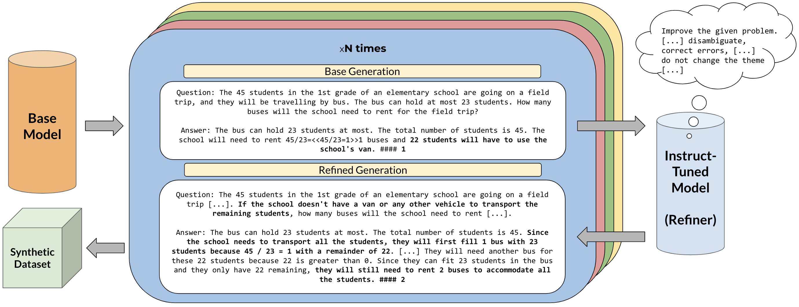
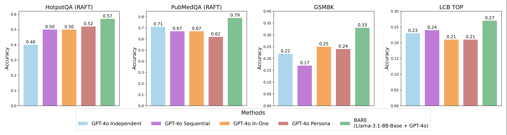

# BARE: Combining Base and Instruction-Tuned Language Models for Better Synthetic Data Generation

Authors: *Alan Zhu\*, Parth Asawa\*, Jared Quincy Davis, Lingjiao Chen, Boris Hanin, Ion Stoica, Joseph E. Gonzalez, Matei Zaharia*

*Equal contribution.

📜 Paper: [arXiv](https://pgasawa.github.io/papers/BARE.pdf)
💻 Code: coming soon!

## 📋 TL;DR

- Instruct models → Higher quality, lower diversity.
- Base models → Higher diversity, lower quality.
- **BARE** → Best of both worlds.

## 🐻 BARE



LLMs need diverse, high-quality synthetic data to train well. But common methods fail at diversity.

We introduce Base-Refine (**BARE** 🐻), a method for combining base language models and instruction-tuned language models for better synthetic data generation.

1️⃣ Generate diverse but potentially lower quality synthetic data with a base model.
2️⃣ Refine each individual data point for quality with an instruction-tuned model.
3️⃣ Fine-tune models for downstream tasks with the final dataset.

Beyond generating training data, the idea of sampling diverse and high-quality responses from LLMs has both a large design space and broad applications -- such as creating evaluation data, generating trajectories, etc.

## 📈 Results

We evaluate **BARE** on multiple domains by fine-tuning Llama 3.1 8B Instruct and Llama 3.2 1B Instruct models for downstream tasks on **BARE**-generated data, including:

- **RAFT (Retrieval-Augmented Fine-Tuning)** → up to 18.4% improvement over SOTA data generation method.
- **GSM8K (Math Reasoning)** → 101% improvement over instruct-only data.
- **LiveCodeBench (Test Output Prediction)** → Performance comparable to SOTA models of similar size with just 1,000 samples.

We also compare **BARE** against various baselines, including base-only sampling, instruct-only sampling, and a variety of prompting methods, finding that fine-tuning with **BARE** beats baseline prompting methods and with the appropriate refiner consistently improves upon all other generation methods. In fact, solely with the addition of a small base model, **BARE**-data can consistently surpass GPT-4o only data generations.



For more detailed evaluations of **BARE**, check out the paper above!

## 📜 License

**BARE** is Apache 2.0 licensed, making it suitable for both academic and commercial use.

## 📧 Contact

Please feel free to reach out at aczhu@berkeley.edu & pgasawa@berkeley.edu!

## 📋 Citation

```text
@article{zhu2025bare,
  title={BARE: Combining Base and Instruction-Tuned Language Models for Better Synthetic Data Generation},
  author={Alan Zhu and Parth Asawa and Jared Quincy Davis and Lingjiao Chen and Boris Hanin and Ion Stoica and Joseph E. Gonzalez and Matei Zaharia},
  year={2025},
  journal={arXiv preprint arXiv:},
} 
```